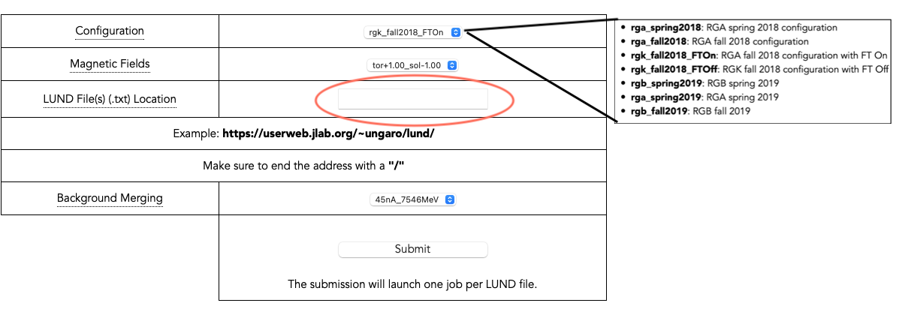

:orphan:

.. _osgSubmit:

.. |br| raw:: html

    

|br|

Jefferson lab users can submit jobs based on this container to the Open Science Grid (OSG)
through the `CLAS12 OSG portal <https://gemc.jlab.org/web_interface/index.php>`_
|br|
|br|

Submit using the CLAS12 Generators
----------------------------------

Browse to the `CLAS12 OSG portal <https://gemc.jlab.org/web_interface/index.php>`_
and click on the **Generator** link - a window like the image below will appear.

Select using the **dropdown menus**:

- the experiment configuration
- the magnetic field configuration for that experiment (the dropdown menu will only show the available fields pairing)
- the generator
- whether or not to include background merging. If yes, which current / beam energy pairing

Once you select the generator, the cell to the right of 'Generator Option' (circled in red below)
will display the link to the generator README page, which document **its list of options**. Note that the number of
desired events is passed automatically to the generator using the portal.

Finally, fill the desired entries for:

- the number of events per job
- the number of jobs for this submission

The total number of events of this submission will be displayed. Click the buttom at the botton to **Submit** jobs to OSG.

|br| |br|
|br| |br|
|br| |br|
|br| |br|
|br| |br|
|br| |br|
|br| |br|
|br| |br|
|br| |br|
|br| |br|

In the example above, 10K jobs will be submitted, each with 10K events, for a total of 100M events for this submission.

|br|
|br|

Submit using LUND Files
----------------------------------

Users can use their own LUND files but this type of submission should only be used
for small jobs and testing purpose.

For large production jobs we recommend to include your generator to the
`CLAS12 Generators Repository <https://github.com/JeffersonLab/clas12-mcgen>`_ (the link include guidelines
and requirements to do that).

|br|

Browse to the `CLAS12 OSG portal <https://gemc.jlab.org/web_interface/index.php>`_
and click on the **LUND Files** link - a window like the image below will appear.

Select using the **dropdown menus**:

- the experiment configuration
- the magnetic field configuration for that experiment (the dropdown menu will only show the available fields pairing)
- whether or not to include background merging. If yes, which current / beam energy configuration

Fill the LUND file location entry with either:

- a public accessible web address pointing to a directories containing a list of LUND files (dat or txt extension)
- a public accessible path in /volatile containing a list of LUND files (dat or txt extension)

Notice: entry should include a path ending with '/'. As an example, take a look at the
directory at https://userweb.jlab.org/~ungaro/lund/.

|br|

Click the button at the botton to **Submit** jobs to OSG.

|br| |br|
|br| |br|
|br| |br|
|br| |br|
|br| |br|
|br| |br|
|br| |br|
|br| |br|

JOB and OSG IDs
---------------

Once you click Submit, the software will prepare the scripts to run your job. Within a few minutes
your submission should appear on the portal home page, see picture below.

|br| |br|
|br| |br|
|br| |br|
|br| |br|
|br| |br|
|br| |br|
|br| |br|

Its **job id** is the auto-increasing index of your submission in the CLAS12 mysql database, while the **osg id** is
an auto-increasing index journaled by the JLab OSG submission node.

Once completed the he output is synced hourly to

	/volatile/clas12/osg2/"username"/job_id

where "username" is your jlab account name. Depending on disk access, it may take a couple of hours from when the jobs
are delisted from the portal to when they appear on /volatile

|br|
|br|

IDLE and HOLD
-------------

Jobs on **IDLE** are waiting to be (re) launched on a the next free OSG nodes.

Jobs on **HOLD** are jobs attempts that failed.
Depending on the cause of the failure, most will be automatically retried.

|br|
|br|

Failures
--------

Some typical failure scenarios with a possible cause are listed below:

- Your submission never appears on the portal (generator): the generator options may cause it to work incorrectly.
- Your submission never appears on the portal (LUND): path non existent or public do not have permissions.
- Your submission appeared but all jobs go to HOLD (LUND): /volatile non accessible or something is wrong with the LUND file.

|br|

|br|
