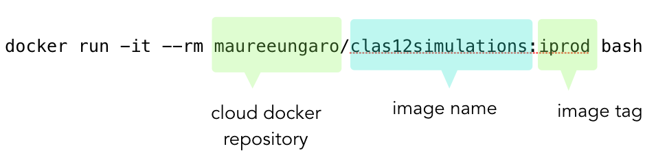
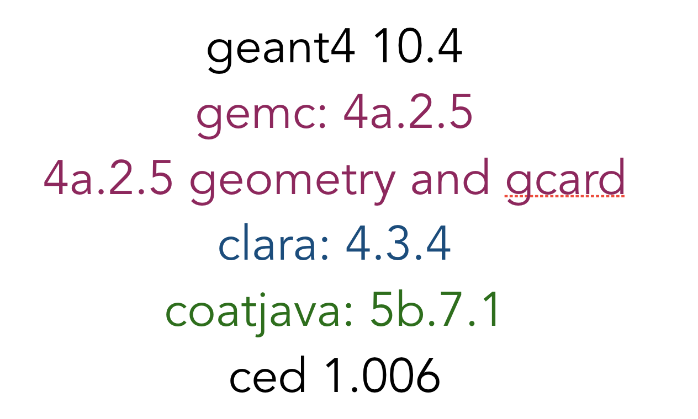

:orphan:

.. |br| raw:: html

    

================================
CLAS12 Docker Tutorial  - *2/10*
================================

While you're downloading the image, let's take a look at the docker command line:

|br|

|br|

|br|

The **docker repository** stores various images on the cloud.
We have several images on "jeffersonlab" and jeffersonlab will be moved there shortly.
Take a look at the `Jefferson Lab repository of images <https://hub.docker.com/u/jeffersonlab>`_.

|br|

**clas12simulations** is the image name. Throughout this tutorial we will use the "**iprod**" tag version.

|br|

Command line options
--------------------

We're executing with the **run** directive and three options

- The **-i** option tells docker to keep the session *interactive*
- The **-t** option tells docker use a text terminal emulator

Both the above options are grouped to **-it**.

If we do not give the *-it* option, the image will keep running in the background and we couldn't CTRL+C out of it.
On the other hand, if we keep it running, we can attach other "sessions" to it, see below.

|br|

The **--rm** option tell docker to remove the container from memory once we're done with it.

|br|

The "**bash**" command at the end is what we want to run in the terminal. We could also use "tcsh". In fact we could give any command here.
Try "top". Notice that when you quit the command (press "q" for "top") docker exits.

|br|

We give a shell command here so the session stay interactive and we can issue commands just like we're running a shell on our laptop.
This is how we'll run the generator, gemc, clara, etc.

|br|
|br|

Whats inside the image tag "iprod"
----------------------------------

The image we'll be using contains the software with the following tags:

|br|

|br|

This tag mechanism is very useful. We could tag this image "1.0" and forever be able to access it.
10 years from now we can compare 3.9 with 1.0 and see all the progress we'be made.

|br|
|br|

Other useful docker commands
----------------------------

This command shows the running containers and their status:

.. code-block:: ruby

 docker ps

gives:

.. code-block:: text

 CONTAINER ID        IMAGE                                  COMMAND   CREATED        STATUS
 42aa50dccf88        jeffersonlab/clas12software:production   "bash"    4 seconds ago  Up 3 seconds

|br|

You could then remove a container (if it's not running) using the CONTAINER ID

.. code-block:: ruby

 docker container rm 42aa50dccf88

|br|

It can be very useful to "attach" to a container session. You can do that by using the container ID:

.. code-block:: ruby

 docker exec -it 42aa50dccf88 bash

You could leave a container running for how long you need it, and simply attach to it.
This is effectively like running a second OS and opening shells inside of it.

|br|
|br|

|

.. image:: ../previous.png
	:target: 	p1.html
	:align: left

.. image:: ../next.png
	:target: 	p3.html
	:align: right

