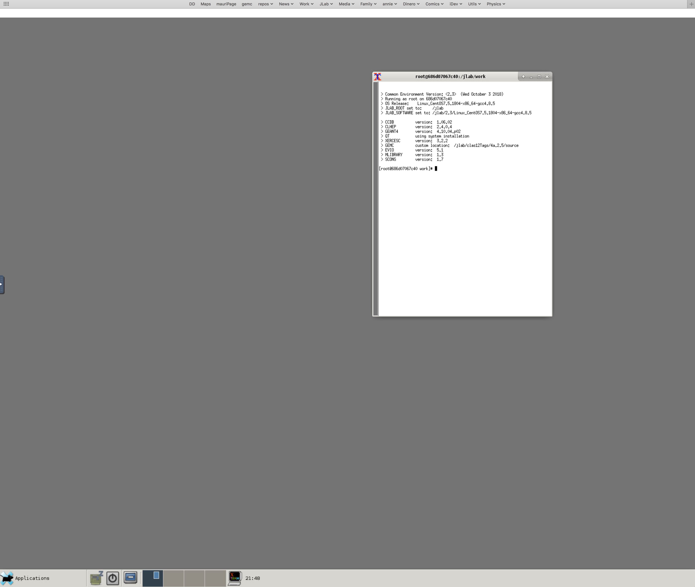

:orphan:

.. |br| raw:: html

    

================================
CLAS12 Docker Tutorial  - *6/10*
================================

Let's exercise that the work is saved in a local directory, and we can exit docker and restart work when we run it again.
Exit docker by typing *exit* and let's learn how to run docker interactively.

Run docker interactively (Mac)
------------------------------

1. Open the XQuartz app and go to preferences and activate the option ‘Allow connections from network clients’ in XQuartz settings.
2. From any terminal::

    defaults write org.macosforge.xquartz.X11 enable_iglx -bool true

The first action will allow XQuartz to receive display messages from network clients, such as docker.

The second command will be useful when running gemc: it will allow OPENGL to use your graphic card.

|br|

Restart XQuartz to activate these changes.

|br|

Finally, add your localhost to the list of accepted X11 connections::

 xhost +127.0.0.1

You should be able now to run docker and use the native X server to open windows application. From now on, this is the command to use::

 docker run -it --rm -v ~/mywork:/jlab/work/mywork -e DISPLAY=docker.for.mac.localhost:0 jeffersonlab/clas12software:production bash

That's a loooooong command isn't it? Good thing you can copy and paste it.

|br|

Run docker interactively (Linux)
--------------------------------

Add your localhost to the list of accepted X11 connections::

 xhost +127.0.0.1

Export the env variable DISPLAY::

 export DISPLAY=:0

Run the command using your local x11 tmp dir::

 docker run -it --rm -v /tmp/.X11-unix:/tmp/.X11-unix -v ~/mywork:/jlab/work/mywork -e DISPLAY=$DISPLAY  jeffersonlab/clas12software:production /bin/bash

|br|

Use X11 on a browser
--------------------

If the above does not work, we can always open a X session using the browser.

The command is now::

 docker run -it --rm -v ~/mywork:/jlab/work/mywork -p 6080:6080 jeffersonlab/clas12software:production

Notice "bash" is no longer present at the end of the command line. This means that the docker image will start the X11 server instead, using the port 6080.

We can connect to that port using the browser. Pont it at::

 http://localhost:6080

After connecting, you should see the image below on your browser.

|br|

We're now ready to rock'n'roll graphically.

|br|

|

.. image:: ../previous.png
	:target: 	p5.html
	:align: left

.. image:: ../next.png
	:target: 	p7.html
	:align: right
