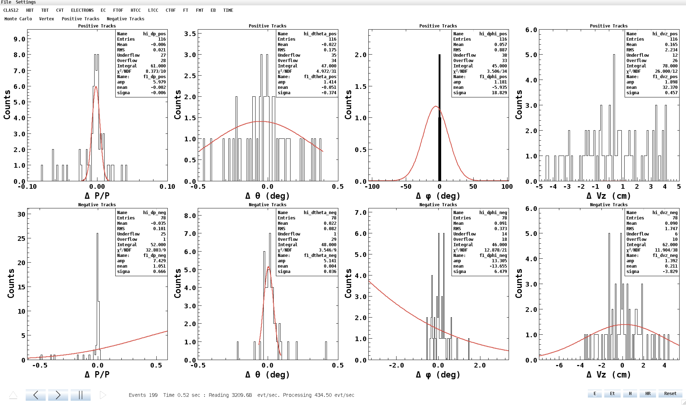
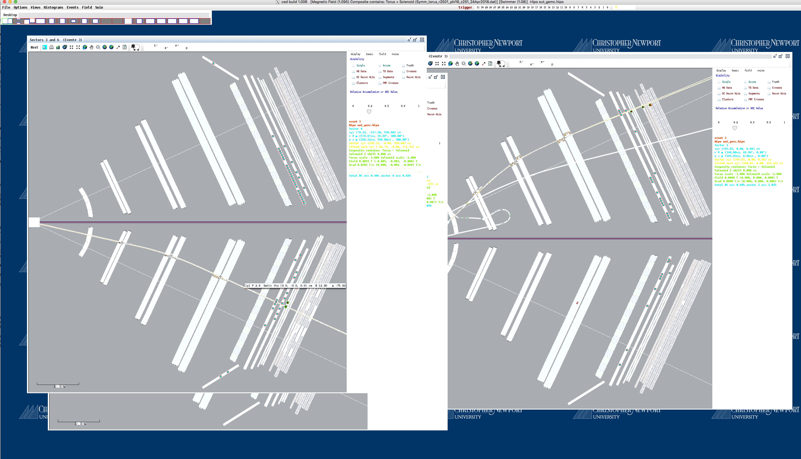

:orphan:

.. |br| raw:: html

    

================================
CLAS12 Docker Tutorial  - *7/10*
================================

Use either the interactive or the vnc option to run docker::

 docker run -it --rm -v ~/mywork:/jlab/work/mywork -e DISPLAY=docker.for.mac.localhost:0 jeffersonlab/clas12software:production bash
 docker run -it --rm -v ~/mywork:/jlab/work/mywork -p 6080:6080 jeffersonlab/clas12software:production

Peeking in the data: kpp-plot
-----------------------------

Let's use kpp-plot to run a quick diagnostic on our 200 events.

Just type::

 kpp-plots

- Click "H" to open the hipo file **out_gemc.hipo** in /jlab/work/mywork/clasdis/.
- Then click "Play".

The statistic is very limited but there is sime interesting quantity to look:

- TBT > Monte Carlo
- TBT > Vertex
- CVT > Posive or Negative Tracks
- FTOF > MIPs

|br|

Run CED
-------

ced comes installed in the docker image. To use::

 cd /jlab/work/cedbuild/
 sh ced.sh

Open the hipo file **out_gemc.hipo** in /jlab/work/mywork/clasdis/.

Use CTRL+N to advance one event at a time.

Enjoy the numerous views of the forward and centran detectors. **Behold the power of ced!**

|br|

|

.. image:: ../previous.png
	:target: 	p6.html
	:align: left

.. image:: ../next.png
	:target: 	p8.html
	:align: right
